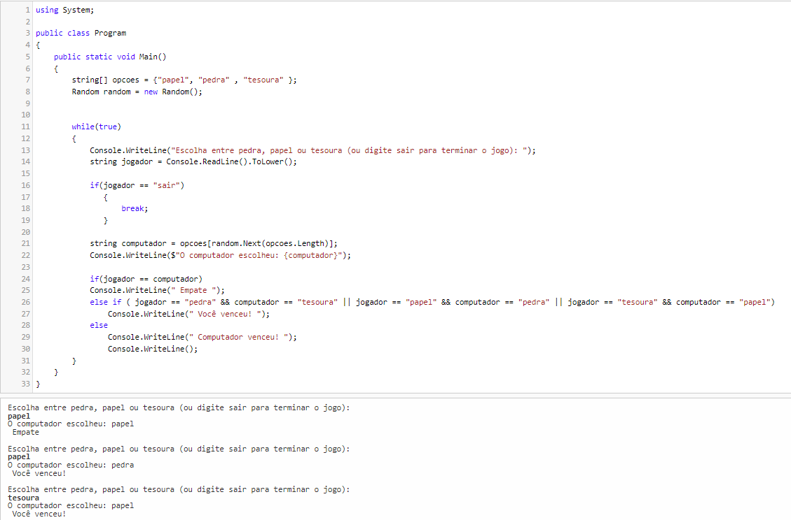

# MeuPrimeiroProjeto

### O que é o jogo Pedra, Papel e Tesoura?

**Pedra, Papel e Tesoura** é um jogo simples de escolha, no qual dois jogadores escolhem entre três opções: Pedra, Papel ou Tesoura. As regras do jogo são as seguintes:

- **Pedra** vence Tesoura (Pedra quebra Tesoura).
- **Tesoura** vence Papel (Tesoura corta Papel).
- **Papel** vence Pedra (Papel envolve Pedra).
- Se ambos os jogadores escolherem a mesma opção, o jogo resulta em empate.

### Como funciona o jogo Pedra, Papel e Tesoura?

No jogo implementado em C#, o jogador escolhe uma das três opções (Pedra, Papel ou Tesoura), e o computador faz uma escolha aleatória. A escolha do jogador é comparada com a do computador, e o programa determina o vencedor com base nas regras do jogo. O jogo pode continuar indefinidamente até que o jogador opte por sair.

### Como construir o jogo em C#?

Aqui está o processo de construção do jogo em C#:

1. **Codificar a lógica do jogo:**
   Como já vimos anteriormente, o código deve capturar a escolha do jogador, gerar uma escolha aleatória do computador e comparar as duas escolhas para determinar o vencedor. Aqui está o código básico de um jogo Pedra, Papel e Tesoura:

   using System;

public class Program
{
public static void Main()
{
string[] opcoes = {"papel", "pedra" , "tesoura" };
Random random = new Random();

while(true)
{
Console.WriteLine("Escolha entre pedra, papel ou tesoura (ou digite sair para terminar o jogo): ");
   string jogador = Console.ReadLine().ToLower();

if(jogador == "sair")
  {
  break;
  }  

string computador = opcoes[random.Next(opcoes.Length)];
Console.WriteLine($"O computador escolheu: {computador}");

if(jogador == computador)
Console.WriteLine(" Empate ");
else if ( jogador == "pedra" && computador == "tesoura" || jogador == "papel" && computador == "pedra" || jogador == "tesoura" && computador == "papel")
Console.WriteLine(" Você venceu! ");
else
Console.WriteLine(" Computador venceu! ");
Console.WriteLine();
}
}
}

   
